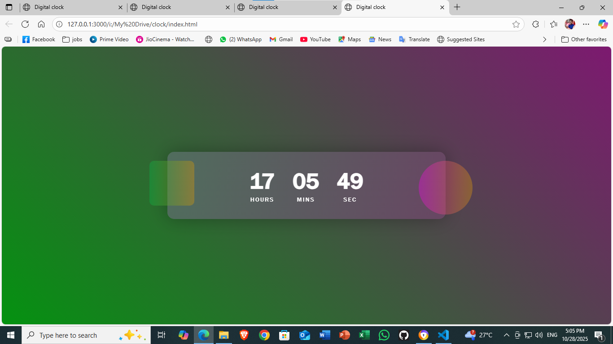

# 🕒 Digital Clock  

A simple and elegant **Digital Clock** built using **HTML, CSS, and JavaScript**.  
It displays the current **hours, minutes, and seconds** in real-time using JavaScript’s `Date()` object and updates automatically every second.  

---

## 📸 Preview  

  
 

---

## 🚀 Live Demo  

🔗 [Visit Website](https://digital-clock-orpin-nine.vercel.app/)   

---

## 🧠 Features  

✅ Real-time updating clock  
✅ Responsive design (works on all devices)  
✅ Clean and minimal UI  
✅ Built using only HTML, CSS & JavaScript  

---

## 🛠️ Tech Stack  

| Technology | Purpose |
|-------------|----------|
| **HTML5** | Structure of the clock |
| **CSS3** | Styling and layout |
| **JavaScript (ES6)** | Real-time functionality |

---

 Directory Path ---
 
Digital-Clock/
│
├── index.html
├── style.css
├── script.js
└── images/
    └── preview.png

    📥 Installation

Clone the repository

git clone https://github.com/yourusername/Digital-Clock.git

Open the folder in your preferred code editor

Run index.html in your browser

💡 Future Enhancements

🕹️ Add Dark/Light Mode

🌍 Display Date & Day

🌈 Add smooth animations

👨‍💻 Author

Suzen Kumar Mohanty
🚀 Frontend Developer | Tech Enthusiast
🌐 Portfolio

📧 suzenkmohanty@example.com

